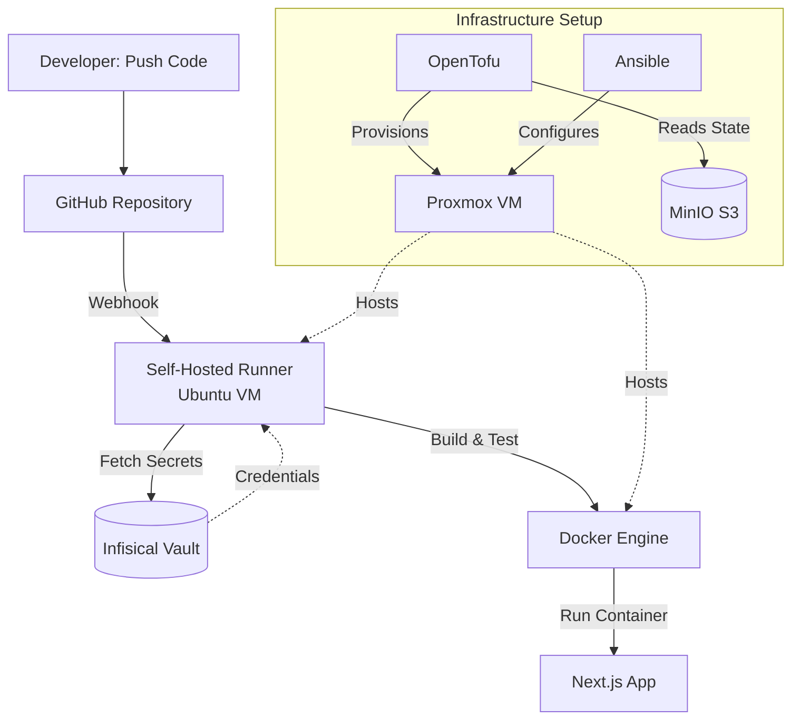

# Portfolio CICD 2.0

## About This Project

This is my portfolio site built with Next.js and deployed through a self-hosted CI/CD pipeline running in my homelab. I wanted to learn proper DevOps practices by actually doing them, not just reading about them.

## The Stack

### Application Side
- Next.js 15 portfolio site with Tailwind CSS for styling
- Everything runs in Docker containers
- GitHub Actions handles the build and test automation

### Infrastructure Side
- **Proxmox VM** running Ubuntu - spun up automatically with OpenTofu
- **Infisical** for secrets - nothing hardcoded anywhere
- **MinIO** for storing Terraform state files (S3-compatible)
- **Ansible** playbook that sets up Docker and all the dependencies
- **Self-hosted GitHub runner** living on the VM

## How It All Works Together



## The Workflow

When I push code to GitHub:

1. A webhook hits my self-hosted runner
2. Runner grabs secrets from Infisical via OIDC (no long-lived tokens)
3. Docker builds and tests run
4. If everything passes, deployment can happen

Infrastructure side:

- All secrets live in Infisical - proper vault, not `.env` files
- OpenTofu provisions the VMs on my Proxmox box
- State files go to MinIO, which means I can run this from any machine
- Ansible handles the VM setup - Docker install, user permissions, all that
- GitHub runner runs as a systemd service so it survives reboots

## Why This Setup?

**Secrets actually secured**  
Using Infisical means no hardcoded credentials anywhere. Runtime injection with `infisical run` and OIDC for GitHub Actions. 

**Infrastructure as Code**  
The VM config is in OpenTofu files, configuration is Ansible playbooks. I can tear down and rebuild everything from scratch without clicking through UIs.

**Self-hosted CI/CD**  
My own runner on my hardware means I can access stuff on my private network (like Infisical and MinIO). Plus I'm not paying per-minute for builds.

**Containerized**  
Multi-stage Docker builds keep the final image small. Runs the same everywhere whether it's my laptop or the production VM.

## Documentation

I documented the setup process for each component:

- **[Setup Journey](setup-process.md)** - how I built this thing step by step
- [MinIO Setup](infrastructure/minio/setup.md) - getting S3-compatible storage running for state files
- [Infisical Setup](infrastructure/infisical/setup.md) - self-hosted secrets vault setup
- [OpenTofu Setup](infrastructure/tofu/setup.md) - provisioning VMs with code

## Tech Used

- **Frontend:** Next.js 15, React 18, TypeScript, Tailwind CSS
- **Infrastructure:** Proxmox VE, OpenTofu, Ansible
- **Secrets:** Infisical (self-hosted)
- **Storage:** MinIO (S3-compatible)
- **CI/CD:** GitHub Actions with self-hosted runner
- **Container:** Docker

## Project Structure

```
My-Portfolio-CICD-2.0/
├── app/                    # Next.js application
│   ├── src/               # Source code
│   ├── public/            # Static assets
│   └── package.json       # Dependencies
├── infrastructure/
│   ├── tofu/              # OpenTofu/Terraform code
│   │   ├── provider.tf    # Proxmox provider
│   │   ├── backend.tf     # MinIO S3 backend
│   │   └── cloud-init.tf  # VM definition
│   └── ansible/           # Configuration management
│       ├── inventory.ini   # Host inventory
│       └── setup-docker.yml # Docker installation
├── .github/workflows/     # CI/CD pipelines
│   ├── pr-ci.yml         # PR validation
│   └── test-infisical.yml # Secret injection test
├── Dockerfile            # Multi-stage app build
└── docs-site/           # This documentation
```
