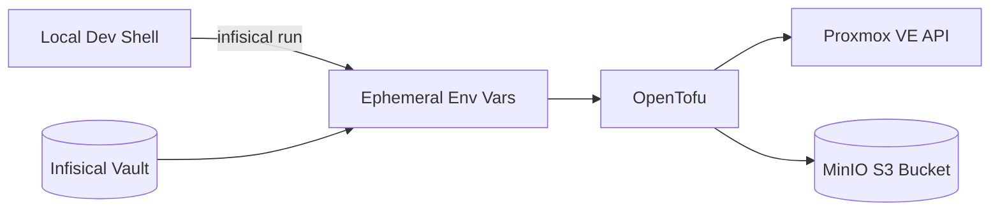

# Homelab Infrastructure & CI/CD Portfolio

This site documents the infrastructure stack I built to showcase secure, reproducible automation in my homelab. It’s intentionally close to real-world patterns (secrets management, state separation, least-privilege) while remaining lightweight and easy to reason about.

## What This Project Demonstrates
- Secrets lifecycle with **Infisical** (no hardcoded creds, runtime injection)
- S3-compatible remote state via **MinIO** (shared automation access)
- Infrastructure plans with **OpenTofu/Terraform** targeting **Proxmox VE**
- Separation of concerns: provider config, secret injection, state backend

## Stack Overview
| Layer | Tool | Purpose |
|-------|------|---------|
| Compute / Virtualization | Proxmox VE | Hosts VMs/containers for services |
| Secrets | Infisical | Central vault + CLI injection |
| State Backend | MinIO | S3 bucket for remote tfstate |
| IaC Engine | OpenTofu | Declarative infra provisioning |
| Docs | MkDocs Material | Static portfolio documentation |

## High-Level Flow
1. I create/update secrets in Infisical (`/tofu` path).
2. Run infra commands wrapped with `infisical run` so environment vars populate.
3. OpenTofu uses the injected creds to talk to Proxmox and MinIO.
4. State persists remotely in the MinIO bucket (`terraform-states`).
5. Changes + rationale are documented here for reviewers (CV / portfolio).



## Key Design Choices
- Runtime injection avoids accidental credential commits.
- Separate MinIO user/policy for Terraform state limits blast radius.
- Proxmox role scoped for Terraform operations only (least privilege).
- Plain Markdown docs + MkDocs: fast iteration, readable diffs.

## Jump In
- Remote State & Backend: [MinIO Setup](infrastructure/minio/setup.md)
- Secrets & Injection: [Infisical Setup](infrastructure/infisical/setup.md)
- Provisioning Flow: [OpenTofu Setup](infrastructure/tofu/setup.md)

## Quick Start Commands
```bash
# Serve docs locally
mkdocs serve

# Inject secrets and plan infra
infisical run --env=prod --path=/tofu -- tofu plan
```

## Next Ideas / Roadmap
- Add CI pipeline using service tokens (GitHub Actions)
- VM provisioning examples (network, storage templates)
- Automated secret rotation script
- MinIO lifecycle policies for state archival

## Contact / Review Notes
Feel free to browse the repo on GitHub: https://github.com/Dawo9889/My-Portfolio-CICD-2.0

> This documentation is intentionally narrative: each decision highlights security, reproducibility, and clarity—things I value when designing infrastructure.
