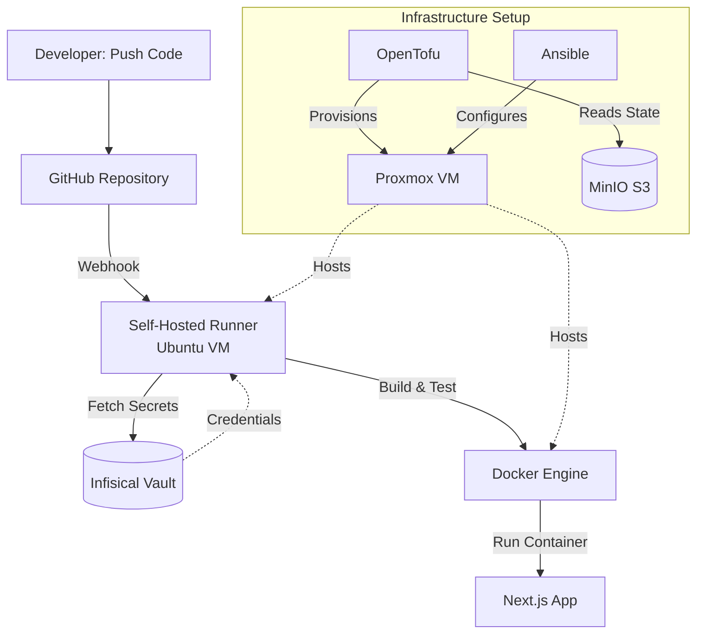

# Portfolio CICD 2.0 - Project Overview

## What This Project Is

A portfolio website built with Next.js, deployed with a complete self-hosted CI/CD pipeline in my homelab. This demonstrates practical DevOps skills using real infrastructure.

## What I Accomplished

### The Application
- Built a responsive portfolio website with Next.js 15 and Tailwind CSS
- Containerized with Docker for consistent deployments
- Automated builds and testing with GitHub Actions

### The Infrastructure
- **Proxmox VM** - Provisioned Ubuntu VM automatically with OpenTofu
- **Secrets Management** - Self-hosted Infisical vault (no hardcoded credentials)
- **State Storage** - MinIO S3-compatible backend for Terraform state
- **Configuration** - Ansible playbook to install Docker and dependencies
- **CI/CD** - Self-hosted GitHub Actions runner on the VM

## The Complete Flow



## How It Works

### Development Workflow
1. I push code to GitHub
2. GitHub triggers the self-hosted runner on my VM
3. Runner fetches secrets from Infisical using OIDC authentication
4. Runs tests and builds the Docker image
5. If tests pass, the app can be deployed

### Infrastructure Management
1. Secrets are stored in self-hosted Infisical
2. OpenTofu code provisions VMs on Proxmox
3. State files stored remotely in MinIO (S3-compatible)
4. Ansible configures VMs with Docker and dependencies
5. GitHub Actions runner installed as a systemd service

## Key Features

**No Hardcoded Secrets**
- All credentials in Infisical vault
- Runtime injection with `infisical run`
- OIDC authentication for GitHub Actions

**Infrastructure as Code**
- VM defined in OpenTofu/Terraform
- Configuration managed with Ansible
- Repeatable and documented

**Self-Hosted CI/CD**
- GitHub Actions runner on my own hardware
- Full control over build environment
- Access to private network resources

**Containerized App**
- Multi-stage Docker build for optimization
- Runs consistently across environments
- Easy to deploy and scale

## Documentation

Detailed setup guides for each component:

- **[How I Set This Up](setup-process.md)** - My journey setting up this project
- [MinIO Setup](infrastructure/minio/setup.md) - S3-compatible storage for Terraform state
- [Infisical Setup](infrastructure/infisical/setup.md) - Self-hosted secrets management
- [OpenTofu Setup](infrastructure/tofu/setup.md) - Infrastructure provisioning with IaC

## Tech Stack

- **Frontend:** Next.js 15, React 18, TypeScript, Tailwind CSS
- **Infrastructure:** Proxmox VE, OpenTofu, Ansible
- **Secrets:** Infisical (self-hosted)
- **Storage:** MinIO (S3-compatible)
- **CI/CD:** GitHub Actions (self-hosted runner)
- **Container:** Docker

## Project Structure

```
My-Portfolio-CICD-2.0/
├── app/                    # Next.js application
│   ├── src/               # Source code
│   ├── public/            # Static assets
│   └── package.json       # Dependencies
├── infrastructure/
│   ├── tofu/              # OpenTofu/Terraform code
│   │   ├── provider.tf    # Proxmox provider
│   │   ├── backend.tf     # MinIO S3 backend
│   │   └── cloud-init.tf  # VM definition
│   └── ansible/           # Configuration management
│       ├── inventory.ini   # Host inventory
│       └── setup-docker.yml # Docker installation
├── .github/workflows/     # CI/CD pipelines
│   ├── pr-ci.yml         # PR validation
│   └── test-infisical.yml # Secret injection test
├── Dockerfile            # Multi-stage app build
└── docs-site/           # This documentation
```
