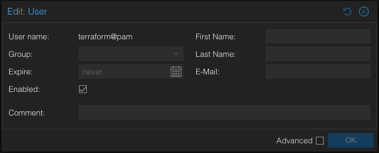
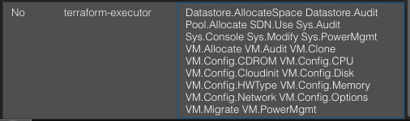
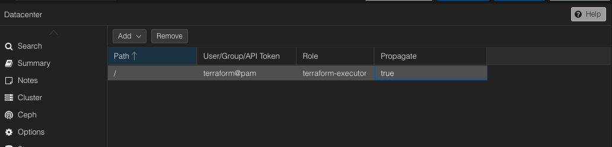
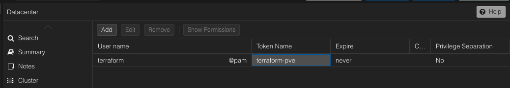

### 1. Overview
I keep this lightweight and safe for local dev.

### 2. Why I chose this setup
- Infisical injects secrets at runtime, so I don’t hardcode credentials in `provider.tf`.
- MinIO hosts the Terraform/OpenTofu state (S3-compatible) so automations on other machines can reference it reliably.

### 3. Quick summary
- Secrets (Proxmox token, MinIO keys) live in Infisical at path `/tofu`.
- OpenTofu reads them via `infisical run ... tofu <cmd>`.
- State backend points to MinIO (`terraform-states` bucket) for portability.

### 4. Provider Config
See the Proxmox provider config below. (Original file: `infrastructure/tofu/provider.tf`)

[View on GitHub](https://github.com/Dawo9889/My-Portfolio-CICD-2.0/blob/feat/changes/infrastructure/tofu/provider.tf)
```tf
terraform {
  required_providers {
    proxmox = {
      source  = "Telmate/proxmox"
      version = "3.0.2-rc05"
    }
  }
}

provider "proxmox" {
  # URL API Proxmox VE
  pm_api_url = "https://pve.dawo9889-homelab.ovh/api2/json"

  # Rest of the authentication details are sourced from environment variables
  # PM_API_TOKEN_ID
  # PM_API_TOKEN_SECRET

}
```

### 5. Proxmox Setup
First, create a user in Proxmox:


For security, create a separate role for Terraform executions:


Assign the role to the user:


Create an API token:


### 6. Infisical Secrets
Save that token (ID + secret) into your Infisical vault at path `/tofu` — see: [Managing Secrets for OpenTofu](../infisical/setup.md#6-infisical-secrets)

Recommended keys in Infisical:
- `PM_API_TOKEN_ID`: Proxmox API Token ID
- `PM_API_TOKEN_SECRET`: Proxmox API Token Secret
- `AWS_ACCESS_KEY_ID`: MinIO access key (for S3 backend)
- `AWS_SECRET_ACCESS_KEY`: MinIO secret key

These map to environment variables that the Proxmox provider and S3 backend read automatically.

### 7. Run Commands
```bash
# Initialize backend with injected secrets
infisical run --env=prod --path=/tofu -- tofu init -reconfigure

# Plan/apply with the same injection
infisical run --env=prod --path=/tofu -- tofu plan
infisical run --env=prod --path=/tofu -- tofu apply
```

### 8. State Backend
MinIO backend details and policy setup: [MinIO Setup](../minio/setup.md)

Backend configuration (original file: `infrastructure/tofu/backend.tf`)
[View backend.tf on GitHub](https://github.com/Dawo9889/My-Portfolio-CICD-2.0/blob/feat/changes/infrastructure/tofu/backend.tf)

```tf

terraform {
    backend "s3" {
        bucket = "terraform-states"                  # Name of the S3 bucket
        endpoint = "https://s3.dawo9889-homelab.ovh"
        key = "portfolio-cicd.tfstate"        # Name of the tfstate file

        # AWS_ACCESS_KEY_ID from env injected
        # AWS_SECRET_ACCESS_KEY from env


        region = "main"                     # Region validation will be skipped
        skip_credentials_validation = true  # Skip AWS related checks and validations
        skip_requesting_account_id = true
        skip_metadata_api_check = true
        skip_region_validation = true
        use_path_style = true
    }
}
```

What this does:

- `bucket`: Points to your MinIO bucket name (`terraform-states`).
- `endpoint`: Your MinIO S3 URL. Use `http://<host>:9000` if no TLS; use `https://...` behind a reverse proxy.
- `key`: Path/name of the state file inside the bucket (organize by project/environment).
- `AWS_ACCESS_KEY_ID` / `AWS_SECRET_ACCESS_KEY`: Not hardcoded; injected via Infisical when you run `tofu`.
- `region`: Arbitrary string for compatibility; validations are skipped.
- `skip_*` flags: Tell the S3 backend to skip AWS-specific checks since MinIO isn’t AWS.
- `use_path_style`: Required for MinIO’s path-style addressing.

How I initialize this safely:
```bash
infisical run --env=prod --path=/tofu -- tofu init -reconfigure
```
This wraps `tofu init` with environment injection, so the backend has credentials without committing them to git.

