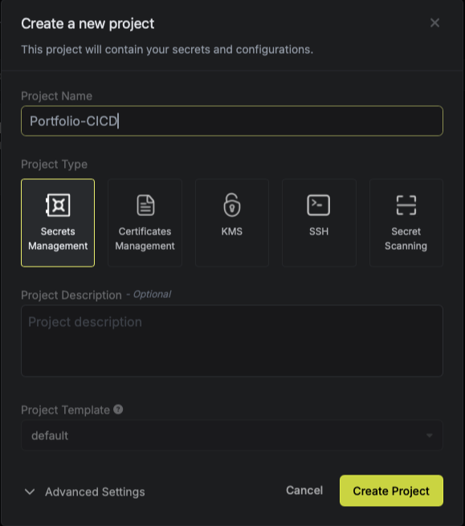
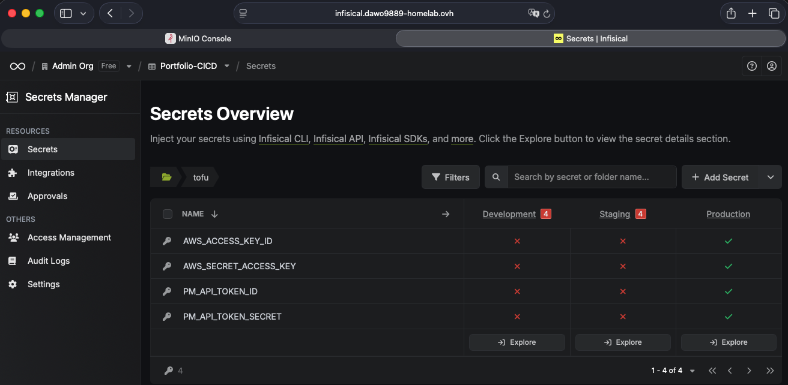

https://infisical.com/docs/self-hosting/deployment-options/docker-compose


```yaml
version: "3"

services:
  backend:
    container_name: infisical-backend
    restart: unless-stopped
    depends_on:
      db:
        condition: service_healthy
      redis:
        condition: service_started
    image: infisical/infisical:latest-postgres
    pull_policy: always
    env_file: .env
    ports:
      - 80:8080
    environment:
      - NODE_ENV=production
    networks:
      - infisical

  redis:
    image: redis
    container_name: infisical-dev-redis
    env_file: .env
    restart: always
    environment:
      - ALLOW_EMPTY_PASSWORD=yes
    networks:
      - infisical
    volumes:
      - redis_data:/data

  db:
    container_name: infisical-db
    image: postgres:14-alpine
    restart: always
    env_file: .env
    volumes:
      - pg_data:/var/lib/postgresql/data
    networks:
      - infisical
    healthcheck:
      test: "pg_isready --username=${POSTGRES_USER} && psql --username=${POSTGRES_USER} --list"
      interval: 5s
      timeout: 10s
      retries: 10

volumes:
  pg_data:
    driver: local
  redis_data:
    driver: local

networks:
  infisical:
```


```sh
# Keys
# Required key for platform encryption/decryption ops
# THIS IS A SAMPLE ENCRYPTION KEY AND SHOULD NEVER BE USED FOR PRODUCTION
ENCRYPTION_KEY=35da558b3c47d77de66ad0487759ad8e

# JWT
# Required secrets to sign JWT tokens
# THIS IS A SAMPLE AUTH_SECRET KEY AND SHOULD NEVER BE USED FOR PRODUCTION
AUTH_SECRET=CBxe3/SlNDQZqO9Ojx70VmBFFFWyvcuGm3pzAWnCXWI=

# Postgres creds
POSTGRES_PASSWORD=infisical
POSTGRES_USER=infisical
POSTGRES_DB=infisical

# Required
DB_CONNECTION_URI=postgres://${POSTGRES_USER}:${POSTGRES_PASSWORD}@db:5432/${POSTGRES_DB}

# Redis
REDIS_URL=redis://redis:6379

# Website URL
# Required
SITE_URL=https://infisical.dawo9889-homelab.ovh
```

It's important to provide unique **ENCRYPTION_KEY** with Must be a random 16 byte hex string. Can be generated with openssl rand -hex 16


**AUTH_SECRET** 
Must be a random 32 byte base64 string. Can be generated with openssl rand -base64 32






https://infisical.com/docs/cli/usage

`brew install infisical/get-cli/infisical`

infisical login

```
# navigate to your project
cd /path/to/project

# initialize infisical
infisical init```

infisical run --env=prod --path=/tofu -- tofu plan 