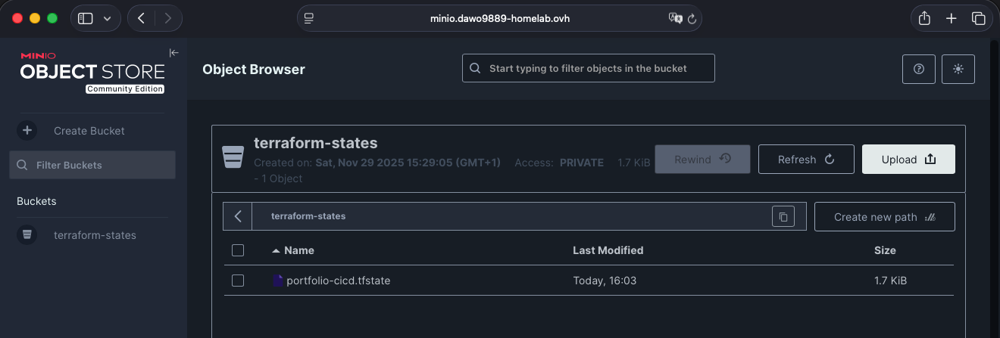

```yaml
services:
    minio:
        ports:
            - 9000:9000
            - 9001:9001
        container_name: minio-server
        volumes:
            - /mnt/minio:/data
        environment:
            - MINIO_ROOT_USER=${MINIO_ROOT_USER}
            - MINIO_ROOT_PASSWORD=${MINIO_ROOT_PASSWORD}
        image: minio/minio:latest
        command: server /data --console-address ":9001"
```

`brew install minio-mc`

`mc alias set minio http://<ADRESs_IP_MINIO>:9000 <MINIO_ROOT_USER> <MINIO_ROOT_PASSWORD>`

`mc mb minio/terraform-states`

Stwórz plik tfstate_policy.json (za pomocą edytora tekstu) i wklej do niego poprawną definicję

```json
{
  "Version": "2012-10-17",
  "Statement": [
    {
      "Action": ["s3:ListBucket"],
      "Effect": "Allow",
      "Resource": ["arn:aws:s3:::terraform-states"], 
      "Sid": "ListBucketForTfState"
    },
    {
      "Action": [
        "s3:PutObject",
        "s3:GetObject",
        "s3:DeleteObject",
        "s3:AbortMultipartUpload"
      ],
      "Effect": "Allow",
      "Resource": ["arn:aws:s3:::terraform-states/*"], 
      "Sid": "ReadWriteObjectsInTfState"
    }
  ]
}
```


`mc admin policy add minio tfstate-policy tfstate_policy.json`

`mc admin user add minio tf-state-user <SECRET>`

`mc admin policy attach myminio tfstate-policy --user tf-state-user`

